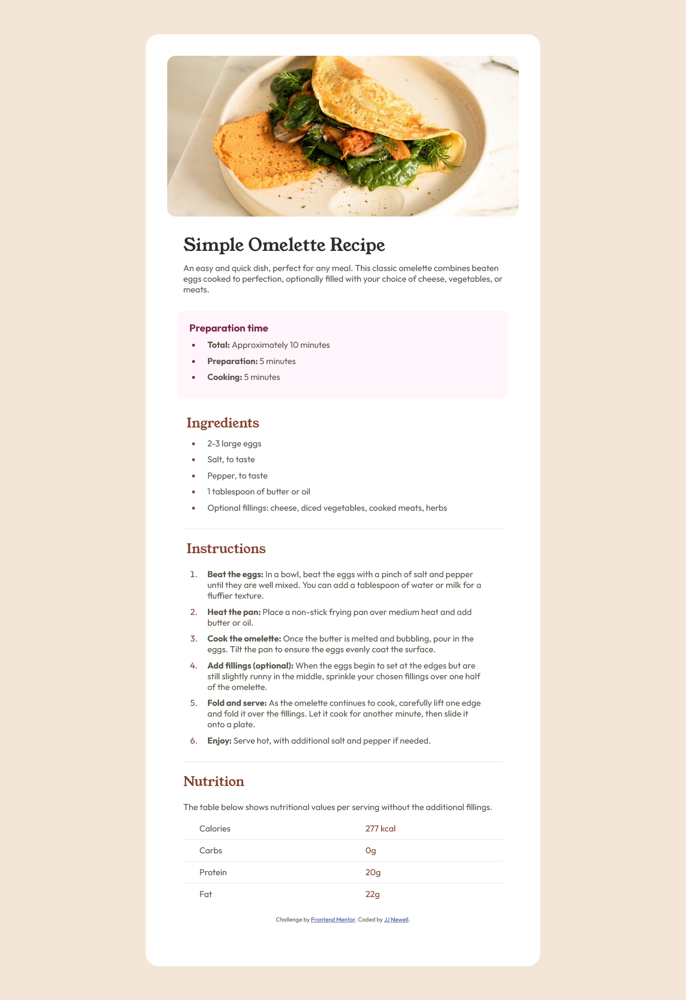

# Frontend Mentor - Recipe page solution

This is a solution to the [Recipe page challenge on Frontend Mentor](https://www.frontendmentor.io/challenges/recipe-page-KiTsR8QQKm). Frontend Mentor challenges help you improve your coding skills by building realistic projects. 

## Table of contents

- [Overview](#overview)
  - [Screenshot](#screenshot)
  - [Links](#links)
  - [Built with](#built-with)
- [Author](#author)

## Overview

A simple recipe page made using HTML/CSS.

### Screenshot

### Links

- Solution URL: [GitHub](https://github.com/TieFit/recipe-book)
- Live Site URL: [Recipe Page](https://tiefit.github.io/recipe-book/)

### Built with

- Semantic HTML5 markup
- CSS custom properties
- Flexbox
- Mobile-first workflow

## Author

- Website - [TieFit](https://github.com/TieFit)
- Frontend Mentor - [TieFit](https://www.frontendmentor.io/profile/TieFit)
